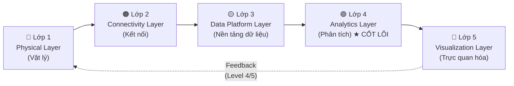
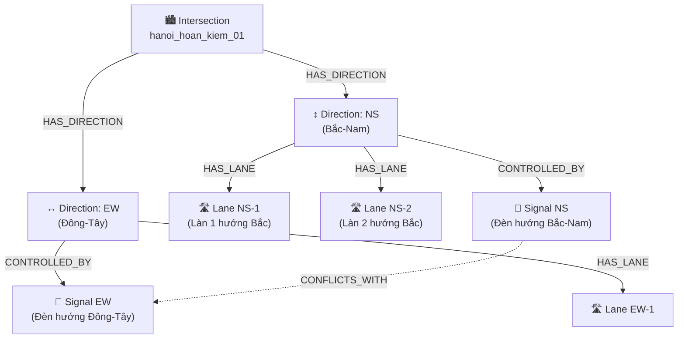
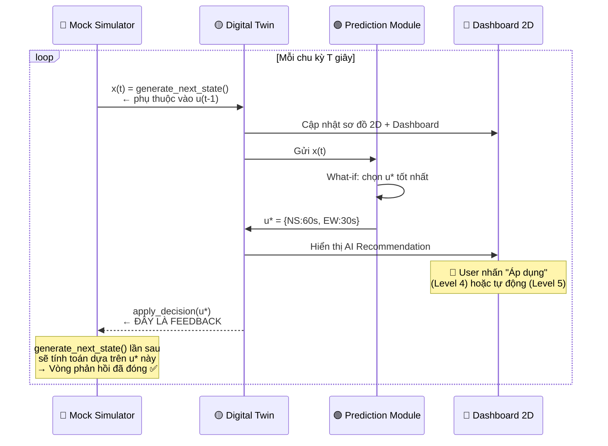
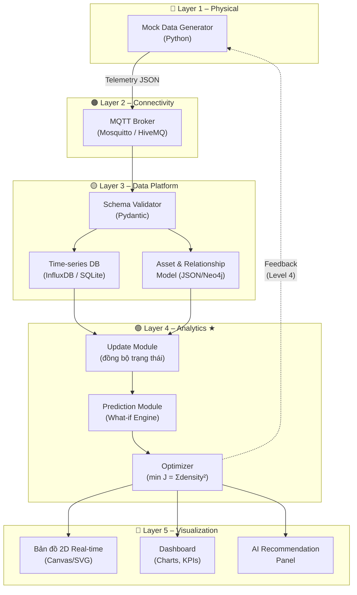

# 🚦 Phân Tích Đề Tài: Digital Twin Mô Phỏng Nút Giao Thông Thông Minh
### *Góc nhìn lý thuyết hệ thống Digital Twin chuẩn — Bài tập lớn môn Digital Twins (Thạc sĩ)*

---

## 1. 📊 Mức Độ Trưởng Thành (Maturity Level)

Hệ thống Digital Twin được phân loại theo thang 5 cấp độ, từ thụ động đến tự trị. Đề tài này hướng tới **Cấp 4 và Cấp 5**:

```
Level 1          Level 2          Level 3           Level 4              Level 5
Descriptive  →  Diagnostic   →   Predictive   →   Prescriptive   →   Autonomous
(Mô tả)         (Chẩn đoán)      (Dự đoán)        (Chỉ dẫn) ★         (Tự trị) ★★
   │                │                │                  │                   │
Hiển thị      Phân tích        Dự báo tắc       Đề xuất thời         Tự động thay
trạng thái   nguyên nhân       nghẽn tương       gian đèn tối         đổi đèn, không
đèn hiện tại  ùn tắc            lai               ưu (What-if)         cần con người
```

> [!IMPORTANT]
> **★ Level 4 – Prescriptive Twin (Đề tài đạt được)**
> Hệ thống kết hợp mô phỏng + ML để phân tích What-if, từ đó **gợi ý** thời gian đèn xanh/đỏ tối ưu. Con người vẫn xác nhận quyết định cuối.
>
> **★★ Level 5 – Autonomous Twin (Hướng mở rộng)**
> Hệ thống **tự áp dụng** chu kỳ đèn vào ngã tư mà không cần can thiệp của con người. Đây là mục tiêu dài hạn trong Smart City thực tế.

### So sánh với một số đề tài khác cùng lĩnh vực

| Đề tài | Mức độ |
|---|---|
| Chỉ hiển thị camera giao thông lên bản đồ | Level 1 |
| Phát hiện và báo cáo điểm ùn tắc | Level 2 |
| Dự báo tắc nghẽn 15 phút tới | Level 3 |
| **Đề tài này: Đề xuất thời gian đèn tối ưu** | **Level 4** |
| Tự động thay đổi đèn theo AI, không cần người | Level 5 |

---

## 2. 🏗️ Kiến Trúc 5 Lớp (5-Layer Architecture)



---

### 🔴 Lớp 1 – Physical Layer (Lớp Vật Lý)

| Trong thực tế | Trong bài tập lớn |
|---|---|
| Camera CCTV tại ngã tư | Code Python sinh **mock data** (dữ liệu giả lập) |
| Cảm biến vòng từ đếm xe | Random/pattern generator mô phỏng mật độ xe |
| Radar, LiDAR | Hàm giả lập theo giờ cao điểm / thấp điểm |
| Bộ điều khiển đèn (PLC) | Biến trạng thái trong chương trình |

**Chiến lược sinh mock data thực tế:**
```python
import random, math, time

def generate_traffic_density(direction: str, hour: int) -> float:
    """
    Giả lập mật độ xe theo hướng và giờ trong ngày.
    Trả về: 0.0 (trống) → 1.0 (tắc nghẽn hoàn toàn)
    """
    # Giờ cao điểm: 7-9h sáng, 17-19h chiều
    peak_morning = math.exp(-((hour - 8) ** 2) / 2)
    peak_evening = math.exp(-((hour - 18) ** 2) / 2)
    base_density = 0.3 * (peak_morning + peak_evening)
    
    # Hướng Bắc-Nam thường đông hơn Đông-Tây
    direction_factor = {"NS": 1.2, "EW": 0.9, "NE": 0.7, "SW": 0.6}
    noise = random.gauss(0, 0.05)  # Nhiễu ngẫu nhiên thực tế
    
    return max(0.0, min(1.0, base_density * direction_factor.get(direction, 1.0) + noise))
```

---

### 🟠 Lớp 2 – Connectivity Layer (Lớp Kết Nối)

**Giao thức được khuyến nghị: MQTT (Publish-Subscribe)**

Tại sao MQTT phù hợp cho telemetry data giao thông:

```
[Mock Data Generator]  →  PUBLISH  →  [MQTT Broker]  →  SUBSCRIBE  →  [Digital Twin Platform]
   (Publisher)              topic:                          topic:          (Consumer)
                        "traffic/intersection_01/NS"    "traffic/+/+"
```

**Cấu trúc Topic MQTT đề xuất:**
```
traffic/{intersection_id}/{direction}
   └── traffic/hanoi_hoan_kiem_01/NS   → Mật độ xe hướng Bắc-Nam
   └── traffic/hanoi_hoan_kiem_01/EW   → Mật độ xe hướng Đông-Tây
   └── traffic/hanoi_hoan_kiem_01/signal → Trạng thái đèn hiện tại
```

**Payload JSON mẫu:**
```json
{
  "timestamp": "2026-06-28T09:30:00Z",
  "intersection_id": "hanoi_hoan_kiem_01",
  "direction": "NS",
  "density": 0.78,
  "vehicle_count": 42,
  "avg_speed_kmh": 12.3,
  "color_level": "RED"
}
```

> [!TIP]
> Có thể dùng **WebSocket** thay MQTT nếu muốn đơn giản hóa cho bài tập lớn. MQTT phù hợp hơn khi muốn demo kiến trúc IoT chuẩn.

---

### 🟡 Lớp 3 – Data Platform Layer (Lớp Nền Tảng Dữ Liệu)

Đây là nơi định nghĩa **"ontology" (bộ xương)** của hệ thống – cách tổ chức và liên kết dữ liệu.

#### 3.1 Asset Model – Khai báo thực thể

```json
{
  "asset_type": "Intersection",
  "id": "hanoi_hoan_kiem_01",
  "properties": {
    "name": "Ngã tư Hoàn Kiếm – Đinh Tiên Hoàng",
    "lat": 21.0285, "lon": 105.8542,
    "num_directions": 4,
    "current_phase": "NS_GREEN",
    "cycle_time_sec": 90
  }
}
```

#### 3.2 Relationship Model – Mô hình đồ thị quan hệ



#### 3.3 Telemetry Schema – Chuẩn hóa dữ liệu đầu vào

```python
from pydantic import BaseModel
from datetime import datetime
from enum import Enum

class ColorLevel(str, Enum):
    GREEN  = "GREEN"   # Mật độ < 30%
    YELLOW = "YELLOW"  # 30-50%
    ORANGE = "ORANGE"  # 50-70%
    RED    = "RED"     # 70-85%
    PURPLE = "PURPLE"  # 85-95%
    BROWN  = "BROWN"   # > 95% (tắc hoàn toàn)

class TrafficTelemetry(BaseModel):
    timestamp: datetime
    intersection_id: str
    direction: str          # "NS", "EW", "NE", "SW"
    density: float          # 0.0 → 1.0
    vehicle_count: int
    avg_speed_kmh: float
    color_level: ColorLevel
```

> [!NOTE]
> Schema chuẩn hóa như trên giúp tránh lỗi dữ liệu khi hệ thống nhận telemetry từ nhiều nguồn khác nhau.

---

### 🟢 Lớp 4 – Analytics Layer (Lớp Phân Tích) ⭐ TRỌNG TÂM

Đây là **"trái tim"** của Digital Twin – nơi ra quyết định thông minh.

#### 4.1 Mô hình State-Space (Vector Trạng Thái)

Hệ thống được mô hình hóa bằng phương trình trạng thái:

$$\mathbf{x}(t+1) = f\bigl(\mathbf{x}(t), \mathbf{u}(t)\bigr) + \mathbf{w}(t)$$

$$\mathbf{y}(t) = g\bigl(\mathbf{x}(t)\bigr) + \mathbf{v}(t)$$

**Trong đó:**

| Ký hiệu | Ý nghĩa | Ví dụ cụ thể |
|---|---|---|
| $\mathbf{x}(t)$ | Vector trạng thái hệ thống | $[x_1, x_2, x_3, x_4]^T$ = mật độ 4 hướng |
| $\mathbf{u}(t)$ | Vector điều khiển (input) | Thời gian đèn xanh mỗi hướng (giây) |
| $\mathbf{y}(t)$ | Vector quan sát | Dữ liệu đo từ cảm biến/camera |
| $\mathbf{w}(t)$ | Nhiễu hệ thống | Xe đột ngột xuất hiện, tai nạn |
| $\mathbf{v}(t)$ | Nhiễu quan sát | Sai số cảm biến, camera bị khuất |

**Vector trạng thái đề xuất cho nút 4 hướng:**

$$\mathbf{x}(t) = \begin{bmatrix} x_1(t) \\ x_2(t) \\ x_3(t) \\ x_4(t) \end{bmatrix} = \begin{bmatrix} \text{Mật độ hướng Bắc-Nam} \\ \text{Mật độ hướng Đông-Tây} \\ \text{Thời gian đã chờ trung bình (NS)} \\ \text{Thời gian đã chờ trung bình (EW)} \end{bmatrix}$$

**Vector điều khiển:**

$$\mathbf{u}(t) = \begin{bmatrix} u_1 \\ u_2 \end{bmatrix} = \begin{bmatrix} t_{green}^{NS} \text{ (giây đèn xanh hướng NS)} \\ t_{green}^{EW} \text{ (giây đèn xanh hướng EW)} \end{bmatrix}$$

**Ràng buộc (Constraints):**

$$u_1 + u_2 = T_{cycle} \quad (\text{tổng chu kỳ cố định, ví dụ: 90 giây})$$
$$u_{min} \leq u_i \leq u_{max} \quad (\text{ví dụ: 15s} \leq u_i \leq 75\text{s})$$

#### 4.2 Phân Tích What-if (Mô phỏng Kịch Bản)

Trước mỗi quyết định, hệ thống chạy **N kịch bản song song** để tìm phương án tốt nhất:

```
Trạng thái hiện tại x(t):  NS=0.78 (đỏ), EW=0.35 (vàng)
                                │
              ┌─────────────────┼─────────────────┐
              ▼                 ▼                 ▼
         Kịch bản A       Kịch bản B         Kịch bản C
         u_NS = 60s       u_NS = 45s         u_NS = 30s
         u_EW = 30s       u_EW = 45s         u_EW = 60s
              │                 │                 │
              ▼                 ▼                 ▼
         x(t+1)_A =       x(t+1)_B =        x(t+1)_C =
         NS=0.41, EW=0.52  NS=0.55, EW=0.43  NS=0.65, EW=0.18
              │                 │                 │
              └─────────────────┼─────────────────┘
                                ▼
                    Hàm mục tiêu: min J = Σ density_i²
                    Kết quả: Chọn Kịch bản A ✓
```

**Hàm mục tiêu (Objective Function):**

$$J(\mathbf{u}) = \sum_{i=1}^{4} w_i \cdot x_i(t+1)^2 + \lambda \cdot \sum_{j} \Delta u_j^2$$

- $w_i$: Trọng số ưu tiên từng hướng (hướng đông hơn → $w_i$ lớn hơn)
- $\lambda$: Hệ số phạt khi thay đổi đèn quá đột ngột (tránh gây rối loạn)

#### 4.3 Mô-đun Prediction (Code gợi ý)

```python
class PredictionModule:
    def __init__(self, cycle_time: int = 90):
        self.cycle_time = cycle_time
        self.min_green = 15
        self.max_green = 75

    def predict_next_state(self, state: dict, action: dict) -> dict:
        """
        Mô phỏng trạng thái ngã tư sau khi áp dụng action.
        state  = {"NS": 0.78, "EW": 0.35}
        action = {"NS_green": 60, "EW_green": 30}
        """
        next_state = {}
        for direction, density in state.items():
            green_time = action.get(f"{direction}_green", 45)
            # Xe thoát ra tỉ lệ với thời gian đèn xanh
            discharge_rate = (green_time / self.cycle_time) * 0.9  # max 90% thoát
            incoming_rate  = density * 0.3  # xe mới vào
            next_density   = max(0.0, density - discharge_rate + incoming_rate)
            next_state[direction] = min(1.0, next_density)
        return next_state

    def what_if_analysis(self, state: dict, candidates: list) -> dict:
        """Chạy What-if cho tất cả kịch bản, trả về kịch bản tốt nhất."""
        best_action, best_score = None, float('inf')
        for action in candidates:
            next_state = self.predict_next_state(state, action)
            score = sum(v ** 2 for v in next_state.values())  # Hàm J
            if score < best_score:
                best_score, best_action = score, action
        return best_action
```

---

### 🔵 Lớp 5 – Visualization Layer (Lớp Trực Quan Hóa)

Vai trò của **đồ họa máy tính**: biến số liệu khô khan thành mô hình 2D sống động.

#### ⚠️ Tại sao BẮT BUỘC phải có sơ đồ 2D?

> [!IMPORTANT]
> **Sơ đồ 2D nút giao thông là thành phần không thể thiếu** trong Lớp 5. Đây là yếu tố cốt lõi phân biệt hệ thống này với một bảng dashboard số liệu thông thường.

| So sánh | Chỉ có Dashboard số liệu | **Có sơ đồ 2D + Dashboard** |
|---|---|---|
| Phân loại | Digital Shadow (Level 1) | ✅ **Digital Twin (Level 4)** |
| Phản ánh không gian vật lý | ❌ Không | ✅ Có — bản sao số trực quan |
| Người dùng nhận thức | Đọc con số | Nhìn thấy ngay vấn đề ở đâu |
| Tính "Twin" | Thiếu | ✅ Đủ — bản sao kỹ thuật số thực sự |

**Kết luận:** Nếu bỏ sơ đồ 2D, hệ thống chỉ là một **monitoring dashboard** — không đạt tiêu chí Digital Twin. Sơ đồ 2D chính là "bản sao số" (*digital replica*) của ngã tư thực tế trong không gian số.

---

#### Sơ đồ 2D cần thể hiện những gì?

| Thành phần | Mô tả | Bắt buộc? |
|---|---|---|
| **Hình học ngã tư** | 4 hướng đường, làn xe, vạch dừng | ✅ Có |
| **Màu mật độ real-time** | Đổi màu theo telemetry data liên tục | ✅ Có |
| **Đèn tín hiệu** | Hiển thị pha đèn hiện tại (xanh/đỏ/vàng) | ✅ Có |
| **Đồng hồ đếm ngược** | Thời gian còn lại của pha đèn | ✅ Có |
| **Nhãn mật độ (%)** | Hiển thị % mật độ từng hướng | ✅ Có |
| **Xe di chuyển (animated)** | Animate xe chạy trên làn | 🔶 Nâng cao |

---

#### Bảng màu mật độ (theo chuẩn Google Maps Traffic)

| Mức mật độ | Màu | Ý nghĩa |
|---|---|---|
| 0% – 30% | 🟢 Xanh lá | Thông thoáng |
| 30% – 50% | 🟡 Vàng | Bình thường |
| 50% – 70% | 🟠 Cam | Hơi đông |
| 70% – 85% | 🔴 Đỏ | Đông đúc |
| 85% – 95% | 🟣 Tím | Rất đông |
| > 95% | 🟤 Nâu | Tắc nghẽn hoàn toàn |

---

#### Layout Dashboard đề xuất (Sơ đồ 2D + Panel số liệu)

```
┌────────────────────────────────────────────────────────────────────┐
│  🚦 Digital Twin – Nút Giao Thông Thông Minh              16:53:41 │
├──────────────────────────────┬─────────────────────────────────────┤
│                              │  📊 Mật Độ Theo Giờ (Real-time)     │
│   [Sơ đồ 2D – BẰNG CANVAS   │  ───────────────────────────────    │
│    hoặc SVG, đổi màu theo   │  NS ██████████░░░░  78%   🔴         │
│    mật độ real-time]         │  EW ████░░░░░░░░░░  35%   🟡         │
│      ↑ [NS: 🔴 78%]          │  NE ████████░░░░░░  62%   🟠         │
│   ←EW:🟡─ ✚ ─EW:🟡→         │  SW ███░░░░░░░░░░░  28%   🟢         │
│      ↓ [NS: 🔴 78%]          ├─────────────────────────────────────┤
│                              │  🤖 AI Recommendation               │
│  🚦 Phase hiện tại: NS_GREEN │  ┌─────────────────────────────┐    │
│  ⏱️  Còn lại: 23s            │  │ ✅ Đề xuất: NS=60s, EW=30s  │    │
│                              │  │ 📉 Dự báo mật độ NS: 41%    │    │
│                              │  │ 🎯 Score: 0.31 (tốt nhất)   │    │
│                              │  └─────────────────────────────┘    │
└──────────────────────────────┴─────────────────────────────────────┘
        ↑                                      ↑
  Bản sao không gian vật lý           Bản sao dữ liệu số liệu
  (thiếu phần này = không phải        (cần CÙNG LÚC với sơ đồ 2D)
   Digital Twin)
```

> [!TIP]
> **Công nghệ gợi ý để vẽ sơ đồ 2D:**
> - **HTML Canvas / SVG** — nhẹ, chạy trực tiếp trên trình duyệt, dễ animate màu sắc
> - **Three.js** — nếu muốn nâng cấp lên 3D sau này
> - **Grafana + Plugin** — nếu đã dùng Grafana cho dashboard

---

## 3. 🔄 Vòng Lặp Phản Hồi (Feedback Loop) — Trọng Tâm Level 4

### 3.1 Feedback Loop là gì & tại sao quan trọng?

**Vòng phản hồi** là đặc điểm then chốt phân biệt các cấp độ Digital Twin:

| Cấp độ | Chiều dữ liệu | Mô tả vòng phản hồi |
|---|---|---|
| Level 1-2 | Physical → Digital (1 chiều) | Chỉ nhận dữ liệu, hiển thị, không phản hồi lại |
| Level 3 | Physical → Digital (1 chiều) | Dự đoán tương lai nhưng vẫn không tác động gì |
| **Level 4** | **Physical ⇄ Digital (2 chiều)** ✅ | **Đề xuất hành động, con người xác nhận, gửi lệnh về Physical** |
| Level 5 | Physical ⇄ Digital (2 chiều tự động) | Tự động gửi lệnh về Physical, không cần người |

> [!IMPORTANT]
> **Vòng phản hồi = luồng dữ liệu đi NGƯỢC chiều**: từ Digital Twin → gửi quyết định → tác động lại thực thể vật lý.
> Nếu dữ liệu chỉ chạy một chiều (Physical → Digital), hệ thống vẫn chỉ là **Digital Shadow**, không phải Digital Twin.

---

### 3.2 Vòng Phản Hồi Level 4 — Chi tiết từng bước

```
╔══════════════════════════════════════════════════════════════════════╗
║                    PHYSICAL WORLD (Thế giới thực)                    ║
║                                                                      ║
║   [Camera/Cảm biến]  →→→  Dữ liệu mật độ xe  →→→  MQTT Broker      ║
║         ↑                                                            ║
║         ║  ← ← ← ← ← ← FEEDBACK ← ← ← ← ← ← ← ← ← ←              ║
║   [Đèn tín hiệu]  ←←←  Lệnh đổi chu kỳ đèn  ←←←  [Con người]      ║
║       thay đổi              (xác nhận)                               ║
╚══════════════════════════════════════════════════════════════════════╝
                                ↕ (Đồng bộ 2 chiều)
╔══════════════════════════════════════════════════════════════════════╗
║                    DIGITAL WORLD (Thế giới số)                       ║
║                                                                      ║
║   [Update Module]  →  [Digital Twin State]  →  [Prediction Module]  ║
║                              ↓                         ↓             ║
║                       [Sơ đồ 2D real-time]   [What-if Analysis]     ║
║                       [Dashboard]             [Chọn u* tối ưu]      ║
║                                                        ↓             ║
║                                               [AI Recommendation]   ║
╚══════════════════════════════════════════════════════════════════════╝
```

**Giải thích từng bước chi tiết:**

#### ➡️ Chiều thuận: Physical → Digital (Update)
```
Bước 1: Cảm biến/Camera đo mật độ xe thực tế
         NS = 78%, EW = 35%
           ↓
Bước 2: Dữ liệu được publish lên MQTT Broker
         topic: "traffic/intersection_01/NS"
           ↓
Bước 3: Update Module nhận, validate, lọc nhiễu
         x(t) = [0.78, 0.35, 45s_wait, 12s_wait]
           ↓
Bước 4: Cập nhật trạng thái Digital Twin
         → Sơ đồ 2D đổi màu Đỏ (hướng NS)
         → Dashboard cập nhật biểu đồ
```

#### 🤖 Xử lý nội bộ: Digital Twin ra quyết định
```
Bước 5: Prediction Module nhận x(t)
           ↓
Bước 6: Chạy What-if — 3 kịch bản song song:
         A: NS=60s, EW=30s  →  dự báo: NS=41%, EW=52%  →  J=0.44
         B: NS=45s, EW=45s  →  dự báo: NS=55%, EW=43%  →  J=0.49
         C: NS=30s, EW=60s  →  dự báo: NS=65%, EW=18%  →  J=0.46
           ↓
Bước 7: Chọn kịch bản A (J nhỏ nhất = tốt nhất)
         u* = {NS_green: 60s, EW_green: 30s}
           ↓
Bước 8: Hiển thị đề xuất lên Dashboard:
         "✅ AI đề xuất: NS=60s, EW=30s"
```

#### ⬅️ Chiều ngược (FEEDBACK): Digital → Physical (Control)
```
Bước 9: [Level 4] Con người xem đề xuất trên Dashboard
         → Nhấn "Áp dụng" để xác nhận
           ↓  (hoặc Level 5: tự động, bỏ qua bước này)
Bước 10: Digital Twin gửi lệnh về Physical:
          POST /api/traffic/intersection_01/signal
          { "NS_green": 60, "EW_green": 30 }
           ↓
Bước 11: Bộ điều khiển đèn (PLC/Controller) nhận lệnh
          → Đèn NS chuyển sang xanh 60 giây
          → Đèn EW chuyển sang đỏ 60 giây
           ↓
Bước 12: Xe cộ thoát ra nhiều hơn hướng NS
          → Chu kỳ tiếp theo: NS đo được = 41% ✅
```

---

### 3.3 Vòng Phản Hồi Trong Hệ Thống Mock (Bài Tập Lớn)

> [!NOTE]
> Vì không có cảm biến/đèn thật, vòng phản hồi được **mô phỏng hoàn toàn trong code**. Điều này vẫn hợp lệ và đúng về mặt kiến trúc.

**Cách đóng vòng phản hồi trong mock system:**

```python
class TrafficSimulator:
    def __init__(self):
        self.state = {"NS": 0.5, "EW": 0.5}   # Trạng thái ban đầu
        self.current_signal = {"NS_green": 45, "EW_green": 45}

    def generate_next_state(self) -> dict:
        """
        FEEDBACK LOOP: Trạng thái tiếp theo PHỤ THUỘC vào quyết định đèn hiện tại.
        Đây chính là vòng phản hồi — output của Digital Twin ảnh hưởng input tiếp theo.
        """
        new_state = {}
        for direction, density in self.state.items():
            green_key = f"{direction}_green"
            green_time = self.current_signal.get(green_key, 45)

            # Xe thoát ra: tỉ lệ với thời gian đèn xanh được cấp
            discharge = (green_time / 90) * 0.85
            # Xe vào thêm: luôn có (giả lập)
            incoming  = 0.25 + random.gauss(0, 0.03)

            new_state[direction] = max(0.0, min(1.0, density - discharge + incoming))
        
        self.state = new_state
        return new_state

    def apply_decision(self, decision: dict):
        """
        FEEDBACK: Nhận quyết định từ Digital Twin, cập nhật trạng thái đèn.
        → Chu kỳ mock data tiếp theo sẽ PHẢN ÁNH hiệu quả của quyết định này.
        """
        self.current_signal = decision
        print(f"[FEEDBACK] Áp dụng: NS={decision['NS_green']}s, EW={decision['EW_green']}s")
```

**Sơ đồ vòng kín trong mock system:**



---

### 3.4 Tóm tắt: Sự khác biệt Level 3 vs Level 4

```
LEVEL 3 — Predictive (Không có feedback):
  Physical → Digital → Dự báo → Hiển thị
                                    ↓
                              (Chỉ để người xem biết,
                               không tác động gì lại)

LEVEL 4 — Prescriptive (CÓ feedback loop ✅):
  Physical → Digital → What-if → Đề xuất u*
      ↑                                ↓
      ←←←←←← [Đèn thay đổi] ←←← [Người xác nhận]
                   ↑
        Trạng thái tiếp theo x(t+1)
        phản ánh hiệu quả của u* ✅
```

> [!IMPORTANT]
> **Điểm mấu chốt để khẳng định Level 4 trong báo cáo:**
> Phải chứng minh rằng **x(t+1) bị ảnh hưởng bởi u\*(t)** — tức là quyết định của Digital Twin thực sự làm thay đổi trạng thái của hệ thống trong chu kỳ tiếp theo. Đây chính là bằng chứng của vòng phản hồi khép kín.

---

## 4. 💎 Giá Trị Khoa Học & Điểm Nổi Bật

### Tại sao đề tài này xứng đáng Level 4?

| Tiêu chí | Digital Shadow (Cấp 1-2) | **Đề tài này (Cấp 4)** |
|---|---|---|
| Dữ liệu | Chỉ nhận, chỉ lưu | Nhận, xử lý, phân tích |
| Ra quyết định | Không | ✅ Có (What-if + Optimization) |
| Phản hồi | Một chiều | ✅ Hai chiều (gửi lệnh về) |
| Giá trị | Giám sát | **Tối ưu hóa vận hành** |

### Những điểm cần chú ý khi viết báo cáo

> [!IMPORTANT]
> **Mô tả rõ vòng phản hồi (feedback loop):** Đây là yếu tố phân biệt Digital Twin với Digital Shadow. Phải chỉ rõ dữ liệu đi từ Physical → Digital và ngược lại Digital → Physical (dù là mock).

> [!NOTE]
> **Validation model:** Mô hình dự đoán của bạn cần được kiểm chứng. Ví dụ: chạy 1000 chu kỳ, so sánh mật độ dự đoán vs. mật độ thực (mock data), tính RMSE.

> [!TIP]
> **Liên hệ lý thuyết**: Trong báo cáo, nên trích dẫn khái niệm **Grieves (2014)** về Digital Twin và **ISO 23247** về Digital Twin trong sản xuất — áp dụng tương tự cho giao thông.

---

## 5. 🗂️ Tóm Tắt Kiến Trúc Toàn Hệ Thống


